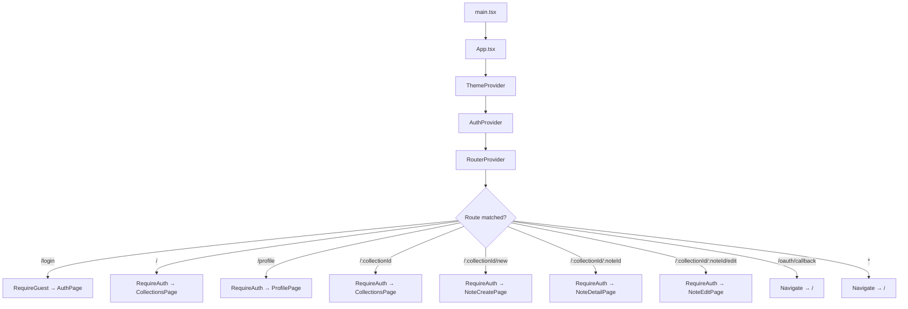
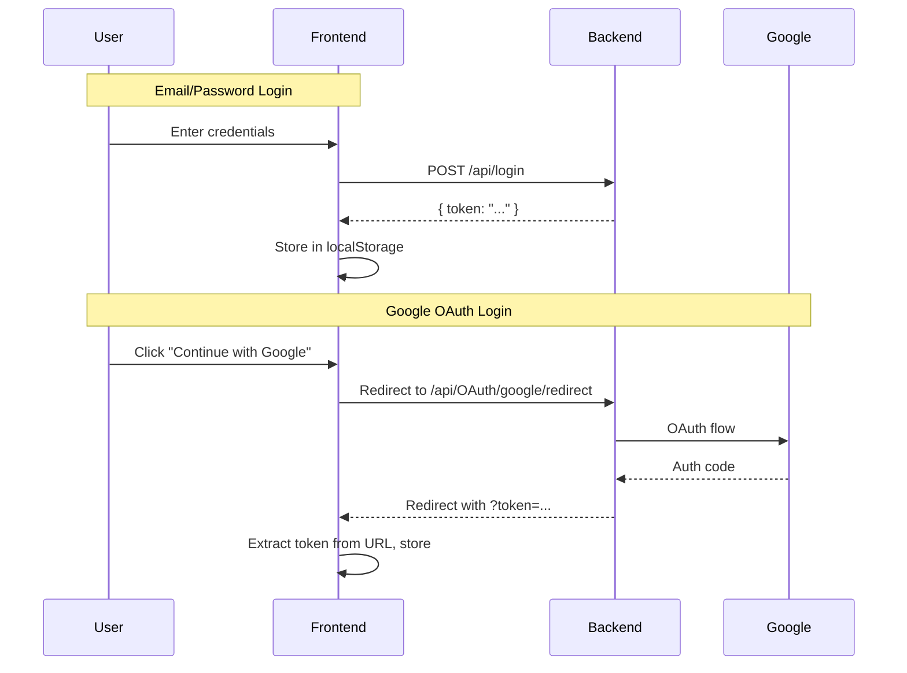
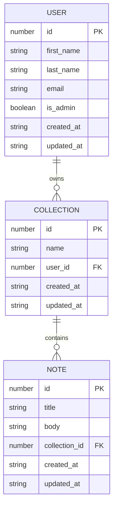
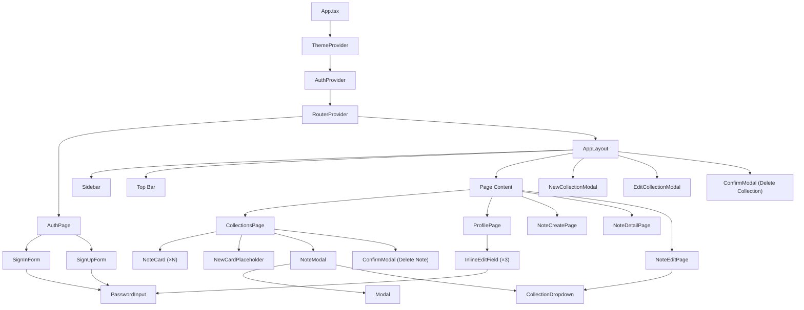
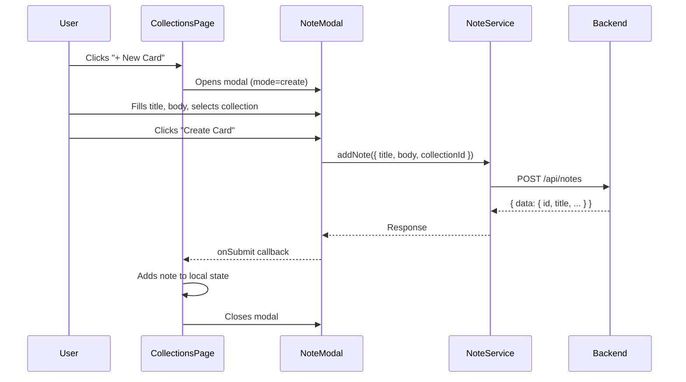
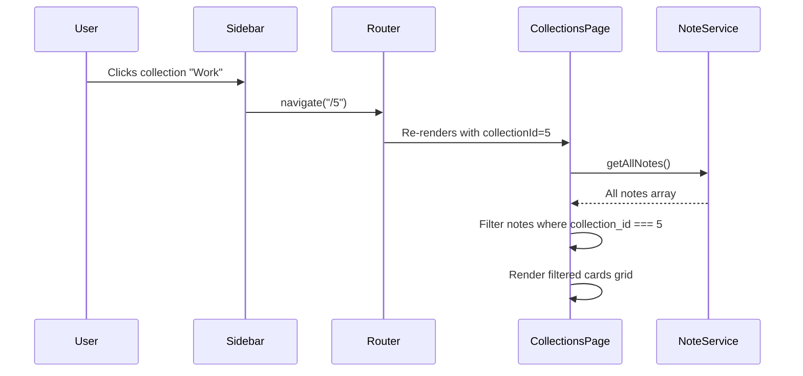

# UnstickyNotes Frontend — Deep Project Analysis

> **Analyzed**: September 10, 2026  
> **Scope**: Full frontend codebase + Tauri desktop shell  
> **Status**: Active development (v0.1.0) — offline sync features scaffolded but not yet implemented

---

## 1. What Is This Project?

**UnstickyNotes** is a personal note-taking application with a **collections-based organization system**. Think of it as a card-based notes app (similar to Google Keep or Notion's quick-notes) where notes ("cards") live inside user-created collections ("folders").

The app has two runtime targets:
1. **Web app** — served by Vite, talks to a PHP/Laravel backend via REST API
2. **Desktop app** — wrapped in [Tauri v2](https://v2.tauri.app/) with an embedded SQLite database for planned offline-first support

---

## 2. Tech Stack at a Glance

| Layer | Technology | Version |
|-------|-----------|---------|
| **UI Framework** | React | 19.2.8 |
| **Language** | TypeScript | 6.0.2 |
| **Build Tool** | Vite | 8.2.2 |
| **Router** | React Router | 8.3.1 |
| **HTTP Client** | Axios | 1.20.0 |
| **Desktop Shell** | Tauri | 2.11.3 |
| **Local DB** | SQLite (via `@tauri-apps/plugin-sql`) | 2.4.1 |
| **Linter** | Oxlint | 1.79.0 |
| **Font** | Plus Jakarta Sans (Google Fonts) | — |
| **Backend** | PHP/Laravel (external, at `localhost:8000`) | — |

---

## 3. Project Structure

```
Frontend/
├── index.html                  # HTML entry point
├── package.json                # Dependencies & scripts
├── vite.config.ts              # Vite config (React plugin)
├── tsconfig.app.json           # TypeScript config (ES2023, React JSX)
├── .oxlintrc.json              # Linter config
│
├── src/                        # ── React Application ──
│   ├── main.tsx                # React DOM render entry
│   ├── App.tsx                 # Root component (providers + router)
│   ├── index.css               # Global design tokens & base styles
│   ├── App.css                 # All component styles (1,259 lines)
│   │
│   ├── types/
│   │   └── index.ts            # TypeScript interfaces (entities, API types)
│   │
│   ├── contexts/
│   │   ├── AuthContext.tsx      # Authentication state & methods
│   │   └── ThemeContext.tsx     # Light/dark theme toggle
│   │
│   ├── services/
│   │   ├── api.ts              # Axios instance + interceptors
│   │   ├── AuthService.ts      # Login, register, logout API calls
│   │   ├── CollectionService.ts# CRUD for collections
│   │   ├── NoteService.ts      # CRUD for notes
│   │   └── ProfileService.ts   # Profile get/update/delete
│   │
│   ├── router/
│   │   └── index.tsx           # Route definitions + auth guards
│   │
│   ├── pages/
│   │   ├── AuthPage.tsx        # Sign in / sign up with sliding panels
│   │   ├── CollectionsPage.tsx # Main dashboard: notes grid per collection
│   │   ├── NoteCreatePage.tsx  # Full-page note editor (create)
│   │   ├── NoteDetailPage.tsx  # Read-only note view
│   │   ├── NoteEditPage.tsx    # Full-page note editor (edit)
│   │   └── ProfilePage.tsx     # User profile with inline-edit fields
│   │
│   ├── components/
│   │   ├── AppLayout.tsx       # Shell: sidebar + topbar + content area
│   │   ├── Sidebar.tsx         # Left nav with collections list
│   │   ├── NoteCard.tsx        # Card component in grid
│   │   ├── NoteModal.tsx       # Create/edit note in a modal
│   │   ├── Modal.tsx           # Generic modal wrapper
│   │   ├── ConfirmModal.tsx    # Destructive action confirmation
│   │   ├── NewCollectionModal.tsx  # Create collection dialog
│   │   ├── EditCollectionModal.tsx # Rename collection dialog
│   │   ├── CollectionDropdown.tsx  # Collection picker dropdown
│   │   ├── NewCardPlaceholder.tsx  # "+ New Card" dashed placeholder
│   │   └── PasswordInput.tsx   # Password field with show/hide toggle
│   │
│   ├── db/                     # ── Local Database (Tauri only) ──
│   │   ├── dbClient.ts         # SQLite connection factory
│   │   └── SyncQueue.ts        # (empty — not yet implemented)
│   │
│   ├── syncServices/           # ── Offline Sync (planned) ──
│   │   ├── SyncManager.ts      # (empty — not yet implemented)
│   │   └── network.ts          # (empty — not yet implemented)
│   │
│   └── assets/
│       ├── hero.png            # Hero image asset
│       ├── react.svg           # React logo
│       └── vite.svg            # Vite logo
│
├── src-tauri/                  # ── Tauri Desktop Shell (Rust) ──
│   ├── Cargo.toml              # Rust dependencies
│   ├── tauri.conf.json         # Window config, bundle settings
│   ├── src/
│   │   ├── main.rs             # Desktop entry point
│   │   └── lib.rs              # Tauri builder with SQL plugin + migrations
│   └── migrations/
│       ├── 1_create_all_tables.sql   # users, notes, collections tables
│       └── 2_create_sync_queue_table.sql # sync_queue table
│
└── .github/workflows/         # CI/CD (contents not inspected)
```

---

## 4. Architecture Deep Dive

### 4.1 Application Bootstrap



**Boot sequence**:
1. `main.tsx` renders `<App />` inside `<StrictMode>`
2. `App.tsx` nests three providers: `ThemeProvider` → `AuthProvider` → `RouterProvider`
3. `AuthProvider` initializes by checking `localStorage` for a saved token **and** the URL query string for an OAuth `?token=` parameter
4. If a token exists, it fetches the user profile from the API
5. Router renders the matched route, guarded by `RequireAuth` or `RequireGuest` wrappers

---

### 4.2 Authentication System

| Feature | Implementation |
|---------|---------------|
| **Token storage** | `localStorage` key `un-token` |
| **Token injection** | Axios request interceptor adds `Authorization: Bearer <token>` |
| **401 handling** | Axios response interceptor clears token and redirects to `/login` |
| **Google OAuth** | Full-page redirect to `localhost:8000/api/OAuth/google/redirect`; backend returns `?token=` in URL, extracted by `AuthContext` on mount |
| **Registration** | POST to `/register`, then auto-login |
| **Logout** | POST to `/logout`, clear localStorage, reset state |

**Auth flow diagram**:



---

### 4.3 Data Model



> [!NOTE]
> There is a **virtual "Unsorted" collection** with `id = -1` that exists only on the frontend. Notes without a collection assignment are treated as belonging to "Unsorted." This is not a database entity.

---

### 4.4 API Service Layer

All API calls go through a single Axios instance configured in [`api.ts`](file:///home/eyob/code/PHP/UnstickyNotes/Frontend/src/services/api.ts):

| Service | File | Endpoints |
|---------|------|-----------|
| **Auth** | [`AuthService.ts`](file:///home/eyob/code/PHP/UnstickyNotes/Frontend/src/services/AuthService.ts) | `POST /register`, `POST /login`, `POST /logout` |
| **Collections** | [`CollectionService.ts`](file:///home/eyob/code/PHP/UnstickyNotes/Frontend/src/services/CollectionService.ts) | `GET /collections`, `POST /collections`, `PUT /collections/:id`, `DELETE /collections/:id` |
| **Notes** | [`NoteService.ts`](file:///home/eyob/code/PHP/UnstickyNotes/Frontend/src/services/NoteService.ts) | `GET /notes`, `GET /notes/:id`, `POST /notes`, `PUT /notes/:id`, `DELETE /notes/:id` |
| **Profile** | [`ProfileService.ts`](file:///home/eyob/code/PHP/UnstickyNotes/Frontend/src/services/ProfileService.ts) | `GET /profile`, `PUT /profile`, `DELETE /profile` |

> [!IMPORTANT]
> **Dual-key pattern**: The codebase sends **both** `camelCase` and `snake_case` variants of field names (e.g., `firstName` and `first_name`) in API payloads. This is a workaround to handle backend inconsistency — the PHP backend likely expects `snake_case`, but some responses may use `camelCase`.

---

### 4.5 State Management

The app uses **React Context + local component state** — no external state management library:

| Context | File | Purpose |
|---------|------|---------|
| `AuthContext` | [`AuthContext.tsx`](file:///home/eyob/code/PHP/UnstickyNotes/Frontend/src/contexts/AuthContext.tsx) | Stores `user`, `token`, `isLoading`; provides `login()`, `register()`, `logout()`, `refreshUser()` |
| `ThemeContext` | [`ThemeContext.tsx`](file:///home/eyob/code/PHP/UnstickyNotes/Frontend/src/contexts/ThemeContext.tsx) | Stores `theme` (`'light'` \| `'dark'`); provides `toggleTheme()`; persists to `localStorage` key `un-theme` |

Page-level state (collections list, notes list, modal visibility, form inputs) is managed with `useState` hooks inside each page component.

---

### 4.6 Routing & Navigation

Defined in [`router/index.tsx`](file:///home/eyob/code/PHP/UnstickyNotes/Frontend/src/router/index.tsx):

| Path | Component | Guard | Purpose |
|------|-----------|-------|---------|
| `/login` | `AuthPage` | `RequireGuest` | Login/register screen |
| `/` | `CollectionsPage` | `RequireAuth` | Redirects to `/-1` (Unsorted) |
| `/profile` | `ProfilePage` | `RequireAuth` | User profile management |
| `/:collectionId` | `CollectionsPage` | `RequireAuth` | Notes grid for a specific collection |
| `/:collectionId/new` | `NoteCreatePage` | `RequireAuth` | Create new note |
| `/:collectionId/:noteId` | `NoteDetailPage` | `RequireAuth` | View a note |
| `/:collectionId/:noteId/edit` | `NoteEditPage` | `RequireAuth` | Edit a note |
| `/oauth/callback` | `Navigate → /` | None | OAuth return landing |
| `*` | `Navigate → /` | None | Catch-all redirect |

**Route guards**:
- `RequireAuth` — redirects to `/login` if no token
- `RequireGuest` — redirects to `/` if already logged in
- Both show a "Loading…" screen while auth state is being determined

---

## 5. Component Architecture

### 5.1 Component Hierarchy



### 5.2 Component Breakdown

#### Layout Components

| Component | File | Role |
|-----------|------|------|
| **AppLayout** | [`AppLayout.tsx`](file:///home/eyob/code/PHP/UnstickyNotes/Frontend/src/components/AppLayout.tsx) | Shell wrapper — renders `Sidebar` + topbar + `{children}`. Also manages collection CRUD modals. |
| **Sidebar** | [`Sidebar.tsx`](file:///home/eyob/code/PHP/UnstickyNotes/Frontend/src/components/Sidebar.tsx) | Left navigation panel. Shows user avatar/name, "Unsorted" collection, user collections with 3-dot context menus (edit/delete), and a "New Collection" button. Smart icon selection based on collection name keywords. |

#### Page Components

| Component | File | Lines | Responsibility |
|-----------|------|-------|----------------|
| **AuthPage** | [`AuthPage.tsx`](file:///home/eyob/code/PHP/UnstickyNotes/Frontend/src/pages/AuthPage.tsx) | 247 | Animated dual-panel sign in/sign up with sliding overlay. Includes Google OAuth button. |
| **CollectionsPage** | [`CollectionsPage.tsx`](file:///home/eyob/code/PHP/UnstickyNotes/Frontend/src/pages/CollectionsPage.tsx) | 260 | Main dashboard. Fetches collections and filters notes by active collection. Handles note CRUD via modals. Most complex page. |
| **NoteCreatePage** | [`NoteCreatePage.tsx`](file:///home/eyob/code/PHP/UnstickyNotes/Frontend/src/pages/NoteCreatePage.tsx) | 125 | Full-page form to create a new note with title + body textarea. |
| **NoteDetailPage** | [`NoteDetailPage.tsx`](file:///home/eyob/code/PHP/UnstickyNotes/Frontend/src/pages/NoteDetailPage.tsx) | 136 | Read-only note view with edit/delete/back action buttons. |
| **NoteEditPage** | [`NoteEditPage.tsx`](file:///home/eyob/code/PHP/UnstickyNotes/Frontend/src/pages/NoteEditPage.tsx) | 206 | Full-page editor with collection picker dropdown. Can also delete from edit view. |
| **ProfilePage** | [`ProfilePage.tsx`](file:///home/eyob/code/PHP/UnstickyNotes/Frontend/src/pages/ProfilePage.tsx) | 248 | Profile card with avatar initials, inline-editable first/last name, read-only email, password change, and sign-out button. |

#### Reusable Components

| Component | File | Key Behavior |
|-----------|------|--------------|
| **Modal** | [`Modal.tsx`](file:///home/eyob/code/PHP/UnstickyNotes/Frontend/src/components/Modal.tsx) | Generic overlay + centered container. Handles Escape key, click-outside-to-close, body scroll lock. |
| **ConfirmModal** | [`ConfirmModal.tsx`](file:///home/eyob/code/PHP/UnstickyNotes/Frontend/src/components/ConfirmModal.tsx) | Destructive action confirmation with async loading state. |
| **NoteModal** | [`NoteModal.tsx`](file:///home/eyob/code/PHP/UnstickyNotes/Frontend/src/components/NoteModal.tsx) | Create/edit note form inside a modal. Includes collection dropdown. Smart dirty-checking disables save when nothing changed. |
| **CollectionDropdown** | [`CollectionDropdown.tsx`](file:///home/eyob/code/PHP/UnstickyNotes/Frontend/src/components/CollectionDropdown.tsx) | Custom dropdown for picking a collection. Supports "up" placement for near-bottom rendering. Icons per option, check marks for active selection. |
| **NoteCard** | [`NoteCard.tsx`](file:///home/eyob/code/PHP/UnstickyNotes/Frontend/src/components/NoteCard.tsx) | Card in the notes grid with title (2-line clamp), body preview (5-line clamp), edit/delete hover buttons. |
| **NewCardPlaceholder** | [`NewCardPlaceholder.tsx`](file:///home/eyob/code/PHP/UnstickyNotes/Frontend/src/components/NewCardPlaceholder.tsx) | Dashed border "+" card to create a new note. |
| **PasswordInput** | [`PasswordInput.tsx`](file:///home/eyob/code/PHP/UnstickyNotes/Frontend/src/components/PasswordInput.tsx) | Password field with inline eye icon toggle for show/hide. Used in auth and profile pages. |

---

## 6. Design System

### 6.1 Theme Architecture

The design system is built entirely with **CSS custom properties** — no utility framework:

- [`index.css`](file:///home/eyob/code/PHP/UnstickyNotes/Frontend/src/index.css) (171 lines) — Design tokens + base reset
- [`App.css`](file:///home/eyob/code/PHP/UnstickyNotes/Frontend/src/App.css) (1,259 lines) — All component styles

**Dual theme support**:

| Token Category | Light ("Warm Linen") | Dark ("Deep Teal / Plum") |
|----------------|---------------------|--------------------------|
| Background | `#f7f2eb` (warm beige) | `#37353e` (dark purple-gray) |
| Card BG | `#ffffff` | `#44444e` |
| Text Primary | `#1a1a14` | `#d3dad9` |
| Accent / Brand | `#8b9a6e` (sage green) | `#c4abaa` (dusty rose) |
| Button Primary | `#2a835f` (forest green) | `#715a5a` (muted plum) |
| Destructive | `#c04040` on `#fce8e8` | `#f48c8c` on translucent red |
| Avatar | `#c8d8b0` (light green) | `#715a5a` (plum) |

Theme is toggled by adding/removing the `.dark` class on `<html>`, persisted to `localStorage` key `un-theme`, and respects `prefers-color-scheme` on first visit.

### 6.2 Typography

- **Font**: Plus Jakarta Sans (loaded from Google Fonts, weights 300-800)
- **Base size**: 17.5px (slightly above standard to match 125% zoom preference)
- **Monospace**: System monospace stack for ID badges

### 6.3 Layout System

- **App shell**: Flexbox — sidebar (260px fixed) + main content (flex: 1)
- **Notes grid**: CSS Grid with `repeat(auto-fill, minmax(240px, 300px))`
- **Note cards**: Fixed 190px height with line-clamp for title (2 lines) and body (5 lines)
- **Responsive**: Below 768px, sidebar hides, grid collapses to single column

### 6.4 Animation & Interaction

| Element | Animation |
|---------|-----------|
| Auth panel slide | `0.65s cubic-bezier(0.65, 0, 0.35, 1)` transform |
| Modal entrance | `0.2s` fade + scale from 96% |
| Dropdown menu | `0.15s` slide + scale |
| Cards hover | `translateY(-1px)` + shadow increase |
| Buttons | `scale(0.97)` on active press |
| Theme transitions | `0.2s ease` on background/color |

---

## 7. Tauri Desktop Shell

### 7.1 Configuration

From [`tauri.conf.json`](file:///home/eyob/code/PHP/UnstickyNotes/Frontend/src-tauri/tauri.conf.json):

| Setting | Value |
|---------|-------|
| Product Name | UnstickyNotes |
| Identifier | `com.eyob.unstickynotes` |
| Window | 800×600, resizable, fullscreen by default |
| Dev URL | `http://localhost:5173` |
| CSP | `null` (disabled — security concern) |
| Bundle targets | All platforms |

### 7.2 Rust Backend ([`lib.rs`](file:///home/eyob/code/PHP/UnstickyNotes/Frontend/src-tauri/src/lib.rs))

The Tauri backend sets up:
1. **Logging plugin** (debug builds only)
2. **SQL plugin** with SQLite database `UnstickyNotes.db`
3. **Two migrations** run automatically on first launch

### 7.3 Database Schema (Local SQLite)

From the [migration files](file:///home/eyob/code/PHP/UnstickyNotes/Frontend/src-tauri/migrations):

**Migration 1** — [`1_create_all_tables.sql`](file:///home/eyob/code/PHP/UnstickyNotes/Frontend/src-tauri/migrations/1_create_all_tables.sql):
```sql
-- users (TEXT primary key for client-generated UUIDs)
-- notes (TEXT PK, remote_id for backend sync, sync_status, soft-delete)
-- collections (TEXT PK, remote_id, sync_status, soft-delete)
```

**Migration 2** — [`2_create_sync_queue_table.sql`](file:///home/eyob/code/PHP/UnstickyNotes/Frontend/src-tauri/migrations/2_create_sync_queue_table.sql):
```sql
-- sync_queue (entity_type, entity_id, action)
```

> [!WARNING]
> **Bug in Migration 1**: The `users` table uses `{` curly braces `}` instead of `(` parentheses `)` — this SQL will **fail** when the migration runs:
> ```sql
> CREATE TABLE IF NOT EXISTS users {  -- ← WRONG, should be (
>     ...
> };                                   -- ← WRONG, should be );
> ```

---

## 8. Data Flow Examples

### 8.1 Creating a Note



### 8.2 Switching Collections



---

## 9. File-by-File Reference

### Source Files (TypeScript/TSX)

| File | Lines | Purpose |
|------|-------|---------|
| [`main.tsx`](file:///home/eyob/code/PHP/UnstickyNotes/Frontend/src/main.tsx) | 11 | React DOM mount |
| [`App.tsx`](file:///home/eyob/code/PHP/UnstickyNotes/Frontend/src/App.tsx) | 16 | Provider nesting + router |
| [`types/index.ts`](file:///home/eyob/code/PHP/UnstickyNotes/Frontend/src/types/index.ts) | 80 | All TypeScript interfaces |
| [`contexts/AuthContext.tsx`](file:///home/eyob/code/PHP/UnstickyNotes/Frontend/src/contexts/AuthContext.tsx) | 112 | Auth state management |
| [`contexts/ThemeContext.tsx`](file:///home/eyob/code/PHP/UnstickyNotes/Frontend/src/contexts/ThemeContext.tsx) | 45 | Theme state management |
| [`services/api.ts`](file:///home/eyob/code/PHP/UnstickyNotes/Frontend/src/services/api.ts) | 35 | Axios instance + interceptors |
| [`services/AuthService.ts`](file:///home/eyob/code/PHP/UnstickyNotes/Frontend/src/services/AuthService.ts) | 34 | Auth API calls |
| [`services/CollectionService.ts`](file:///home/eyob/code/PHP/UnstickyNotes/Frontend/src/services/CollectionService.ts) | 26 | Collection API calls |
| [`services/NoteService.ts`](file:///home/eyob/code/PHP/UnstickyNotes/Frontend/src/services/NoteService.ts) | 41 | Note API calls |
| [`services/ProfileService.ts`](file:///home/eyob/code/PHP/UnstickyNotes/Frontend/src/services/ProfileService.ts) | 33 | Profile API calls |
| [`router/index.tsx`](file:///home/eyob/code/PHP/UnstickyNotes/Frontend/src/router/index.tsx) | 71 | Routes + guards |
| [`pages/AuthPage.tsx`](file:///home/eyob/code/PHP/UnstickyNotes/Frontend/src/pages/AuthPage.tsx) | 247 | Auth UI |
| [`pages/CollectionsPage.tsx`](file:///home/eyob/code/PHP/UnstickyNotes/Frontend/src/pages/CollectionsPage.tsx) | 260 | Dashboard |
| [`pages/NoteCreatePage.tsx`](file:///home/eyob/code/PHP/UnstickyNotes/Frontend/src/pages/NoteCreatePage.tsx) | 125 | Create note |
| [`pages/NoteDetailPage.tsx`](file:///home/eyob/code/PHP/UnstickyNotes/Frontend/src/pages/NoteDetailPage.tsx) | 136 | View note |
| [`pages/NoteEditPage.tsx`](file:///home/eyob/code/PHP/UnstickyNotes/Frontend/src/pages/NoteEditPage.tsx) | 206 | Edit note |
| [`pages/ProfilePage.tsx`](file:///home/eyob/code/PHP/UnstickyNotes/Frontend/src/pages/ProfilePage.tsx) | 248 | Profile |
| [`components/AppLayout.tsx`](file:///home/eyob/code/PHP/UnstickyNotes/Frontend/src/components/AppLayout.tsx) | 169 | Shell layout |
| [`components/Sidebar.tsx`](file:///home/eyob/code/PHP/UnstickyNotes/Frontend/src/components/Sidebar.tsx) | 255 | Navigation sidebar |
| [`components/NoteCard.tsx`](file:///home/eyob/code/PHP/UnstickyNotes/Frontend/src/components/NoteCard.tsx) | 69 | Note card |
| [`components/NoteModal.tsx`](file:///home/eyob/code/PHP/UnstickyNotes/Frontend/src/components/NoteModal.tsx) | 150 | Note form modal |
| [`components/Modal.tsx`](file:///home/eyob/code/PHP/UnstickyNotes/Frontend/src/components/Modal.tsx) | 43 | Generic modal |
| [`components/ConfirmModal.tsx`](file:///home/eyob/code/PHP/UnstickyNotes/Frontend/src/components/ConfirmModal.tsx) | 64 | Confirm dialog |
| [`components/NewCollectionModal.tsx`](file:///home/eyob/code/PHP/UnstickyNotes/Frontend/src/components/NewCollectionModal.tsx) | 80 | New collection dialog |
| [`components/EditCollectionModal.tsx`](file:///home/eyob/code/PHP/UnstickyNotes/Frontend/src/components/EditCollectionModal.tsx) | 86 | Edit collection dialog |
| [`components/CollectionDropdown.tsx`](file:///home/eyob/code/PHP/UnstickyNotes/Frontend/src/components/CollectionDropdown.tsx) | 153 | Collection picker |
| [`components/NewCardPlaceholder.tsx`](file:///home/eyob/code/PHP/UnstickyNotes/Frontend/src/components/NewCardPlaceholder.tsx) | 29 | New card button |
| [`components/PasswordInput.tsx`](file:///home/eyob/code/PHP/UnstickyNotes/Frontend/src/components/PasswordInput.tsx) | 66 | Password field |
| [`db/dbClient.ts`](file:///home/eyob/code/PHP/UnstickyNotes/Frontend/src/db/dbClient.ts) | 5 | SQLite connection |
| [`db/SyncQueue.ts`](file:///home/eyob/code/PHP/UnstickyNotes/Frontend/src/db/SyncQueue.ts) | 0 | Empty — planned |
| [`syncServices/SyncManager.ts`](file:///home/eyob/code/PHP/UnstickyNotes/Frontend/src/syncServices/SyncManager.ts) | 0 | Empty — planned |
| [`syncServices/network.ts`](file:///home/eyob/code/PHP/UnstickyNotes/Frontend/src/syncServices/network.ts) | 0 | Empty — planned |

### Style Files

| File | Lines | Purpose |
|------|-------|---------|
| [`index.css`](file:///home/eyob/code/PHP/UnstickyNotes/Frontend/src/index.css) | 171 | Design tokens (light/dark), CSS reset, base typography |
| [`App.css`](file:///home/eyob/code/PHP/UnstickyNotes/Frontend/src/App.css) | 1,259 | Every component style in the application |

### Tauri / Rust Files

| File | Lines | Purpose |
|------|-------|---------|
| [`src-tauri/src/main.rs`](file:///home/eyob/code/PHP/UnstickyNotes/Frontend/src-tauri/src/main.rs) | 7 | Desktop entry point |
| [`src-tauri/src/lib.rs`](file:///home/eyob/code/PHP/UnstickyNotes/Frontend/src-tauri/src/lib.rs) | 38 | Tauri builder + migrations |
| [`Cargo.toml`](file:///home/eyob/code/PHP/UnstickyNotes/Frontend/src-tauri/Cargo.toml) | 27 | Rust dependencies |
| [`tauri.conf.json`](file:///home/eyob/code/PHP/UnstickyNotes/Frontend/src-tauri/tauri.conf.json) | 41 | App config |

**Total estimated source code**: ~2,800 lines TypeScript/TSX + 1,430 lines CSS + 72 lines Rust/SQL

---

## 10. Identified Issues & Technical Debt

### 🔴 Critical

| # | Issue | Location | Description |
|---|-------|----------|-------------|
| 1 | **SQL syntax error** | [`1_create_all_tables.sql`](file:///home/eyob/code/PHP/UnstickyNotes/Frontend/src-tauri/migrations/1_create_all_tables.sql#L2) | `users` table uses `{` braces instead of `(` parentheses — migration will crash on Tauri desktop launch |
| 2 | **CSP disabled** | [`tauri.conf.json`](file:///home/eyob/code/PHP/UnstickyNotes/Frontend/src-tauri/tauri.conf.json#L23) | `"csp": null` disables Content Security Policy entirely, exposing the desktop app to XSS attacks |
| 3 | **Hardcoded localhost** | [`api.ts`](file:///home/eyob/code/PHP/UnstickyNotes/Frontend/src/services/api.ts#L4), [`AuthPage.tsx`](file:///home/eyob/code/PHP/UnstickyNotes/Frontend/src/pages/AuthPage.tsx#L83) | API base URL `http://localhost:8000/api` and Google OAuth URL are hardcoded — no environment variable support |

### 🟡 Medium

| # | Issue | Location | Description |
|---|-------|----------|-------------|
| 4 | **Typo in SQL column** | [`2_create_sync_queue_table.sql`](file:///home/eyob/code/PHP/UnstickyNotes/Frontend/src-tauri/migrations/2_create_sync_queue_table.sql#L3-L4) | `entitiy_type` and `entitiy_id` — misspelled "entity" |
| 5 | **Duplicate data fetching** | [`CollectionsPage.tsx`](file:///home/eyob/code/PHP/UnstickyNotes/Frontend/src/pages/CollectionsPage.tsx#L56) | Fetches ALL notes via `getAllNotes()` then filters client-side; should use a backend endpoint like `GET /collections/:id/notes` |
| 6 | **Duplicated icon components** | Multiple files | `PencilIcon`, `TrashIcon`, `ChevronLeftIcon` are defined separately in `NoteCard.tsx`, `NoteDetailPage.tsx`, `NoteEditPage.tsx`, `ProfilePage.tsx`, and `Sidebar.tsx` |
| 7 | **Dual-key payload hack** | [`AuthService.ts`](file:///home/eyob/code/PHP/UnstickyNotes/Frontend/src/services/AuthService.ts#L12-L18), [`NoteService.ts`](file:///home/eyob/code/PHP/UnstickyNotes/Frontend/src/services/NoteService.ts#L15-L18), [`ProfileService.ts`](file:///home/eyob/code/PHP/UnstickyNotes/Frontend/src/services/ProfileService.ts#L19-L24) | Sends both `firstName`/`first_name` simultaneously — fragile workaround for backend naming inconsistency |
| 8 | **`any` type usage** | [`AuthPage.tsx`](file:///home/eyob/code/PHP/UnstickyNotes/Frontend/src/pages/AuthPage.tsx#L70), [`AuthContext.tsx`](file:///home/eyob/code/PHP/UnstickyNotes/Frontend/src/contexts/AuthContext.tsx#L69) | `catch (err: any)` and `(res as any)?.token` — loss of type safety |
| 9 | **No error boundaries** | App-wide | No React Error Boundary — unhandled errors in any component will crash the entire app |
| 10 | **Giant CSS file** | [`App.css`](file:///home/eyob/code/PHP/UnstickyNotes/Frontend/src/App.css) | 1,259 lines in a single file; should be split per component or adopt CSS modules |

### 🟢 Low / Improvement Opportunities

| # | Issue | Description |
|---|-------|-------------|
| 11 | **No loading skeletons** | Pages show "Loading…" text instead of skeleton UI |
| 12 | **No search/filter** | No way to search notes across collections |
| 13 | **"Forgot password" is a dead link** | `href="#forgot"` goes nowhere |
| 14 | **Missing tests** | Zero test files — no unit, integration, or e2e tests |
| 15 | **Offline sync unimplemented** | `SyncQueue.ts`, `SyncManager.ts`, `network.ts` are all empty files |
| 16 | **Profile picture placeholder** | `setPfp` endpoint is commented out in `ProfileService.ts` |
| 17 | **No `.env` config** | No `.env` file or `import.meta.env` usage for API URLs |
| 18 | **Unused `build` dependency** | `"build": "^0.1.4"` in `package.json` is likely unnecessary |

---

## 11. Security Considerations

| Area | Status | Notes |
|------|--------|-------|
| Token in localStorage | ⚠️ Risky | Vulnerable to XSS — consider `httpOnly` cookies instead |
| Token in URL (OAuth) | ⚠️ Risky | `?token=` in URL is visible in browser history; cleaned up via `replaceState` but still logged by servers |
| CSP | ❌ Disabled | `tauri.conf.json` sets CSP to `null` |
| API error exposure | ⚠️ | Backend validation errors are displayed directly to users |
| CORS | ✅ Handled | Backend (Laravel) likely handles CORS; frontend doesn't need to |
| Input sanitization | ⚠️ | React auto-escapes JSX, but no explicit XSS sanitization on note body (if rich text is ever added) |

---

## 12. How to Run

### Web Development
```bash
cd Frontend
npm install
npm run dev          # Starts Vite on http://localhost:5173
```
> Requires the PHP/Laravel backend running on `http://localhost:8000`

### Desktop (Tauri)
```bash
cd Frontend
cargo install tauri-cli    # If not already installed
npx tauri dev              # Builds and launches desktop app
```

### Available Scripts
| Script | Command | Purpose |
|--------|---------|---------|
| `dev` | `vite` | Start dev server |
| `build` | `tsc -b && vite build` | Type-check + production build |
| `lint` | `oxlint` | Run linter |
| `preview` | `vite preview` | Preview production build |

---

## 13. Summary & Recommendations

### What's Done Well ✅
- Clean component decomposition with clear separation of concerns
- Well-designed dual-theme system with comprehensive CSS custom properties
- Proper auth flow with route guards and token interceptors
- Good accessibility: ARIA labels, role attributes, keyboard navigation
- Thoughtful UX: loading states, error messages, disabled states, escape-to-close
- Smart sidebar icon assignment based on collection name keywords
- Browser autofill styling properly handled for both themes

### Priority Improvements 🎯

1. **Fix the SQL migration bug** — curly braces in the `users` table DDL
2. **Add environment variables** — replace hardcoded `localhost:8000` URLs
3. **Enable CSP** in `tauri.conf.json`
4. **Extract shared icons** into a single `Icons.tsx` file
5. **Add error boundaries** at the page level
6. **Implement the offline sync layer** (SyncQueue → SyncManager → network)
7. **Add filtering endpoint** to avoid fetching all notes then filtering client-side
8. **Add tests** — at minimum, unit tests for services and integration tests for auth flow
9. **Split `App.css`** into component-scoped CSS modules or files
10. **Resolve the dual-key naming** by normalizing to one convention with a backend API contract

